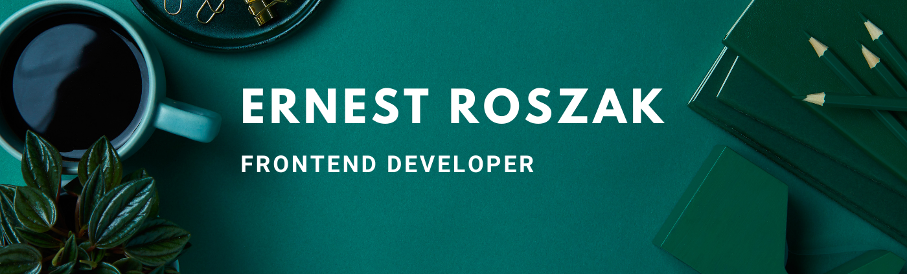

# Project Name

Ernest Roszak - portfolio

## Table of contents

- [General info](#general-info)
- [Technologies](#technologies)
- [Setup](#setup)
- [Features](#features)
- [Status](#status)
- [Inspiration](#inspiration)
- [Contact](#contact)

## General info

This is my Portfolio page. I did before I started witch frameworks, so it's created in sematic HTML.

## Technologies

Project is created with:
-webpack starter kit
-HTML + CSS + JS
-GitHub API
-CSS Grid
-CSS Flex

## Setup

To run this project, install it locally using npm:

```
$ cd portfolio
$ npm install
$ npm start
```

Go on http://localhost:8080

## Features

List of features:

- Skills feature
- Projects feature
- Contact feature

## Status

Project is: _finished_, I will add my new projects in the future.

## Inspiration

I have created a simple, aesthetic site where I will be adding my other projects. All projects are added automatically from my github. There is a demo version for each, where you can preview the final effect and a link to the github repository with all the code.

## Contact

Created by [@Ernest Roszak](https://ernest-roszak.github.io/) - feel free to contact me!
